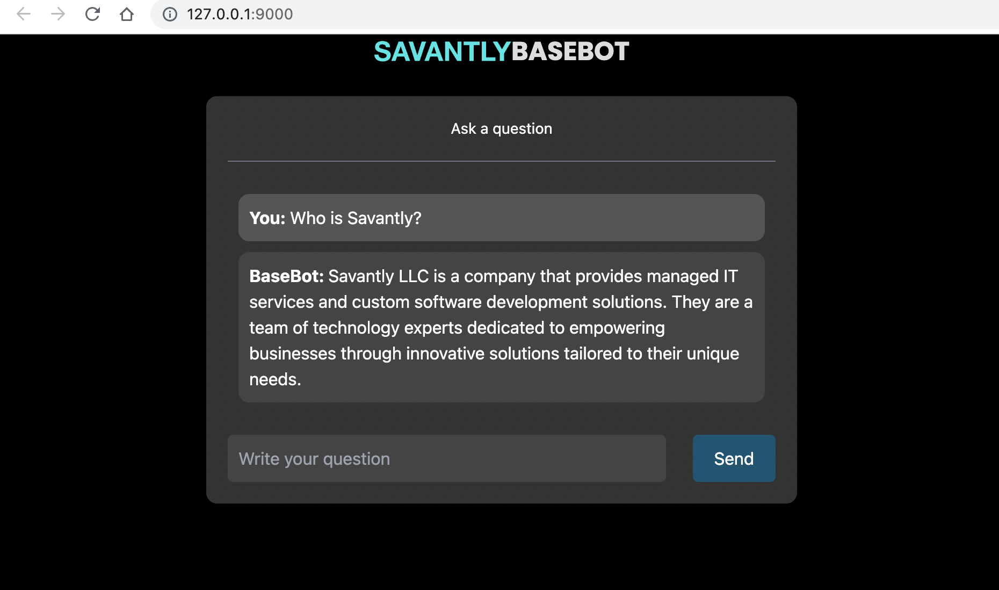

# Savantly base-bot

This is a chat bot based on the LangChain chat bot, packaged up and parameterized for easy re-use.  
The app leverages LangChain's streaming support and async API to update the page in real time for multiple users.  

You can run the docker container with mounted volumes to modify the default behavior.   



## TLDR;
Run in docker (requires your OPENAI_API_KEY as an env variable)  
```shell
docker run -p 9000:9000 -e OPENAI_API_KEY=${OPENAI_API_KEY} savantly/base-bot
```

Or deploy the Helm Chart [chart info](./helm/base-bot/)

[Helm](https://helm.sh) must be installed to use the charts.  Please refer to
Helm's [documentation](https://helm.sh/docs) to get started.

Once Helm has been set up correctly, add the repo as follows:

    helm repo add base-bot https://savantly.github.io/base-bot

If you had already added this repo earlier, run `helm repo update` to retrieve
the latest versions of the packages.  You can then run `helm search repo
base-bot` to see the charts.

To install the base-bot chart:

    helm install my-base-bot base-bot/base-bot

To uninstall the chart:

    helm delete my-base-bot


## Customizing
The easiest way to get started is to copy the `docker-compose.yml` to your project folder and create a data directory for your own domain.  
You can get starter data here - [./data](./data)  
The do `docker compose up` .

Override other settings as needed.  

## ✅ Developing
1. Install dependencies: `pip install -r requirements.txt`
1. Run `ingest.sh` to ingest LangChain docs data into the vectorstore (only needs to be done once).
   1. You can use other [Document Loaders](https://langchain.readthedocs.io/en/latest/modules/document_loaders.html) to load your own data into the vectorstore.
1. Run the app: `make start`
1. Open [localhost:9000](http://localhost:9000) in your browser.


## Configuration 
Modify the `settings.py` to customize the chat parameters.  
Add a `.secrets.py` file to hold your secret data.  

Both of these files can be mounted in place if you're using the pre-built Docker image.  

### Environment Variables
If you're running the docker image, you can easily customize the configurations by using environment variables.  

Prefix the configuration items with `SAVANTLY_CHAT_` to pass env vars directly to the base-bot configuration.  

For example - 

```shell
SAVANTLY_CHAT_UI_PAGE_TITLE="My Bot"
```

### LLM Configs
Use these parameters to modify the LLM configuration  

```python
LLM_REPRHASING_MODEL = "gpt-3.5-turbo"
LLM_REPHRASING_TEMPERATURE = 0.0
LLM_REPHRASING_VERBOSE = True
LLM_STREAMING_MODEL = "gpt-3.5-turbo"
LLM_STREAMING_TEMPERATURE = 0.0
LLM_STREAMING_VERBOSE = True
```

### White labeling 
Use these settings to customize the branding -  

```python
UI_PAGE_TITLE = "Savantly Base Bot"
UI_PAGE_DESCRIPTION = "Savantly Base Bot"
UI_PAGE_FAVICON = "https://savantly.net/img/favicon.png"
UI_SHOW_HEADER = True
UI_HEADER_CENTER = True
UI_HEADER_TITLE = "BASEBOT"
UI_HEADER_LOGO_SRC = "https://savantly.net/img/logo.png"
UI_HEADER_LOGO_ALT = "Savantly Logo"
UI_HEADER_LOGO_HREF = "https://savantly.net"
UI_CHAT_BOT_NAME = "BaseBot"
```


## 📚 Technical description

There are two components: ingestion and question-answering.

Ingestion has the following steps:

1. Scan the `./data/docs` folder for content to load. The scan ignores any files that begin with a dot.  
2. Load the documents with LangChain's DirectoryLoader.  
3. Split documents with LangChain's [TextSplitter](https://langchain.readthedocs.io/en/latest/reference/modules/text_splitter.html)
4. Create a vectorstore of embeddings, using LangChain's [vectorstore wrapper](https://python.langchain.com/en/latest/modules/indexes/vectorstores.html) (with OpenAI's embeddings and FAISS vectorstore).

Question-Answering has the following steps

1. Given the chat history and new user input, determine what a standalone question would be (using GPT-3).
2. Given that standalone question, look up relevant documents from the vectorstore.
3. Pass the standalone question and relevant documents to GPT-3 to generate a final answer.


## Chatwoot Integration

An endpoint is provided for Chatwoot webhook integration.  
This allows Base-Bot to reply as an "Agent Bot" for any Chatwoot inbox.  
Enable it with the setting `CHATWOOT_ENABLED = True`  

Additional Settings  
```python
CHATWOOT_URL = "https://chatwoot.com"
CHATWOOT_BOT_TOKEN = ""
CHATWOOT_BOT_VARIANT = ""
```

The webhook URL for Base-Bot is `/chatwoot/bot`


## Roadmap

- [x] Parameterize prompts and ingestion settings
- [x] Enable loading docs from a folder
- [x] Create Docker image
- [x] Create docker-compose for rapid testing
- [ ] Create parameters and code to substitute the pickled vector store for Pinecone or another implementation
- [x] Create Helm chart
- [ ] Create web-component for dropping the chat on any web page 
- [ ] Parameterize additional chain settings??
